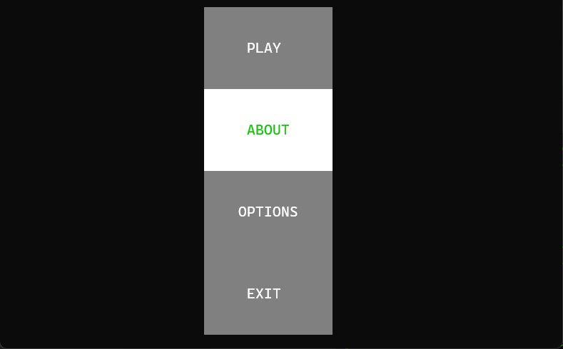

# Tic Tac Toe - Terminal User Interface (TUI)

- **The project was created for educational purposes.**
- **Based on [FTXUI](https://github.com/ArthurSonzogni/FTXUI) library**
- **C++20**
- **Note:** The program is running on Windows 11 Terminal in the GIF and Campbell Color Scheme. Keep this in mind if the game looks different in your terminal.

## Keys/Mouse

- **Escape or 'q' - quit**
- **Arrows (Left, Right, Up, Down) or Mouse for select**
- **Enter/Mouse - left click to make a move**
- **'X' moves first**

## How to build

### You need a compiler that supports C++20 and CMake (if you use CMakePresets, you will need also Ninja)

    git clone github.com/birland/tictactoe
    cd tictactoe
You can use IDE or VSCode (with the CMake Tools plugin) to build using CMake  and use one of the available CMakePresets. Or use the instructions for the terminal below.

- **Note:** The project uses **CPM** by default, but you can use the **-DUSE_CPM_PACKAGES_ENABLED=OFF** flag to disable this and find_package will be used instead.

## Terminal: Using ninja

    cmake --list-presets
    cmake --preset <preset-name>
    cmake --build build/

Run executable

    ./build/<preset-name-folder>/bin/tic-tac-toe

## Terminal: Using make

    cmake -S . -B build
    cd build
    make -j8

Run executable

    ./build/bin/tic-tac-toe

## Tested on x64 and on these compilers

- **GCC 14.2.0**
- **Clang 19.1.1**
- **MSVC 19.44**

## Used libraries

- [FTXUI](https://github.com/ArthurSonzogni/FTXUI)
- [fmt](https://github.com/fmtlib/fmt)
- [toml++](https://github.com/marzer/tomlplusplus)
- [Microsoft GSL](https://github.com/microsoft/gsl)
